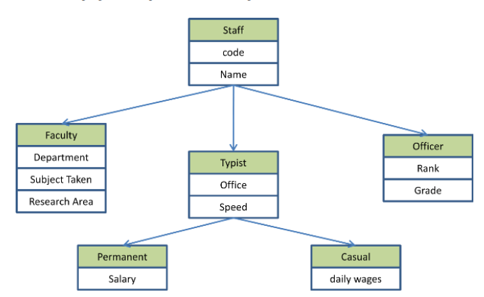
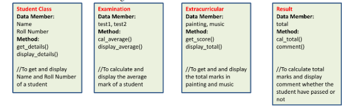

># 
**OOP in C++**

>> ### Taught by : _[Dr.Syed Zeeshan Hussain](https://www.jmi.ac.in/computerscience/faculty-members/Dr_Syed_Zeeshan_Hussain-2203 "See Profile")_

MCA SEMESTER-II

 

LAB ASSIGNMENT FOR OOP in C++

***

**[View All Assignments](https://github.com/wasitshafi/JMI-MCA/tree/master/II-sem/C%2B%2B/Assignments)**
**[View All Practice Programs](https://github.com/wasitshafi/JMI-MCA/tree/master/II-sem/C%2B%2B/Practice)**

> # I- Class, object, Function

[Q1. Write an inline function to obtain largest of three numbers.](Assignments/Assig.%20I/jmi_p1.cpp "View Code")

[Q2. Write a function called hms_to_secs() that takes three int values—for hours, minutes, and seconds—as arguments, and returns the equivalent time in seconds (type long). Create a program that exercises this function by repeatedly obtaining a time value in hours, minutes, and seconds from the user (format 12:59:59), calling the function, and displaying the value of seconds it returns](Assignments/Assig.%20I/jmi_p2.cpp "View Code")

<a href= "Assignments/Assig.%20I/jmi_p3.cpp" title = "View Code">
Q3. Define a class to represent a bank account. It contains
  + Data Members:
    - Name of the depositor 
    - Account Number 
    - Type of account 
    - Balance 
  + Member Functions: 
    - To assign initial values 
    - To deposit an amount 
    - To withdraw an amount < amount available 
    - Display the name and balance.
    
</a>

<a href= "Assignments/Assig.%20I/jmi_p4.cpp" title = "View Code"> 
Q.4  Create a bank account by supplying a user id and password. 
Login using their id and password.
  Quit the program.
  Now if login was successful the user will be able to do the following: 
    - Withdraw money. 
    - Deposit money. 
    - Request balance.
  Quit the program.
  If login was not successful (for example the id or password did not match) then the user will be taken back to the introduction menu. 
</a>
  
  <a href= "Assignments/Assig.%20I/jmi_p5.cpp" title = "View Code"> 
 Q.5 Create a class to add Two times provided in hour minute format. Use functions
a) void input() to provide hour and minute.  
b) void gettime(int ,int) to take hour and minute entered by user. 
c) sum(time <oj>, time <ob> )  to add minutes and hours. If minutes is > 60 add 1 with hour.
d) void display() to display the result.
</a>

<a href= "Assignments/Assig.%20I/jmi_p6.cpp" title = "View Code"> 
 Q.6 To write a C++ program to add two complex numbers using object as argument.
  
**Algorithm:** 
    **class** as complex. 
    **data members** as real and img.  
    **member functions**  
        - void getdata()   
        - void show()   
        - void sum(complex c1,complex c2)   
        - getdata() method is used to get the values .  
        - show() method is used to display the values.  
        - sum() method is used to perform addition operation using object as argument.
</a>
  
  <a href= "Assignments/Assig.%20I/jmi_p7.cpp" title = "View Code">
Q.7 To write a C++ program to display the student details using class and array of object.
  
**Algorithm:** 
   **class** as student.  
   **data members** rollno, name, mark1, mark2, mark3, total and average. 
   **member functions** as getdata() and displaydata(). 
        - getdata() method used to get the  student details. 
        - displaydata() method used to display the student details.  
Create an object array for the student class using the following syntax :  
           Get the number of students. 
           Enter student details  
           display the student details
</a>
           
  <a href= "Assignments/Assig.%20I/jmi_p8.cpp" title = "View Code">
Q.8 Re-write the time addition program using friend function.
</a>

  <a href= "Assignments/Assig.%20I/jmi_p9.cpp" title = "View Code">
Q.9  write C++ program to define matrix and vector class, to use function with default argument and to do matrix -vector  multiplication using friend function.
- Declare vector Class 
- Define matrix Class
- Declare friend function multiply() inside the matrix class  
- Define vector Class  
- Declare friend function multiply(matrix &, vector &) inside the vector class  
- Define getvector() function with for loop to get the elements for vector  
- Define disvector() function with for loop to display the contents of vector  
- Define getmatrix() function with nested for loops to get the matrix elements  
- Define dismatrix() function with nested for loops to display the matrix  
- Define the multiply() to multiply matrix and vector 
    • a. No of columns in the matrix should be equal to no. of elements in the vector 
    • b. Apply the matrix-vector multiplication mechanism: 
    • For simplicity take the matrix as 3X3 and the vector as 1X3. 
</a>
> # II- Constructor
<a href= "Assignments/Assig.%20II/jmi_p1.cpp" title = "View Code">
Q.1 Write a C++ program to add two complex numbers.
  
 i) The class Complex contains three constructors. 
 &emsp;a) One with no parameter. (Used for the object for storing result.) 
 &emsp;b) With one parameter(Same value for real and imaginary part) 
 &emsp;c) With two parameters. 
 and 
 ii) Two friend functions 
 &emsp;a) One to add two complex number by taking two reference variables of class complex and returning another reference. 
 &emsp;b) To display the result 
</a>
 
<a href= "Assignments/Assig.%20II/jmi_p2.cpp" title = "View Code">
Q.2 A Bank gives 4% interest on current account and 6% interest on savings account. An additional 3% interest is provided for savings duration of 5 years and above. Using dynamic initialization of constructor write banking program using C++.
</a>

> # III- Operator Overloading and Type Conversion
<a href= "Assignments/Assig.%20III/jmi_p1.cpp" title = "View Code">
Q.1 Check whether a number is even or odd by overloading ! operator
</a>

<a href= "Assignments/Assig.%20III/jmi_p2.cpp" title = "View Code">
Q.2 ii) Check whether a number is prime or not by overloading -- operator
[Hints Use the concept of overloading ! operator]. 
</a>

<a href= "#">
Q.3 Add two complex number by overloading + operator
</a>
<a href= "Assignments/Assig.%20III/jmi_p3-a.cpp" title = "View Code">&emsp;&emsp; a) Using Member function.</a>
<a href= "Assignments/Assig.%20III/jmi_p3-b.cpp" title = "View Code">&emsp;&emsp;b) Using Friend Function.</a>

<a href= "#">
Q.4 Class Distance consists of length in feet and inches. Class Distance contains
i) one default constructor
ii) one parameterized constructor
iii) function getdata() to take the value of feet and inches.
iv) function show() to display.

</a>
<a href= "Assignments/Assig.%20III/jmi_p4-a.cpp" title = "View Code">a) Overload < operator to compare two distances.</a>
<a href= "Assignments/Assig.%20III/jmi_p4-b.cpp" title = "View Code">b) Overload += operator in the Distance class. </a>
</a>

<a href= "Assignments/Assig.%20III/jmi_p5.cpp" title = "View Code">
Q.5Concatenate two strings by overloading + operator.
&emsp; &emsp;<a href= "Assignments/Assig.%20III/jmi_p5-a.cpp" title = "View Code">  a) Overload ++ as prefix (++c1) and postfix (c1++) in some class.</a>
&emsp; &emsp;<a href= "Assignments/Assig.%20III/jmi_p5-b.cpp" title = "View Code">  b) Overload == operator to compare two strings.</a>

<a href= "Assignments/Assig.%20III/jmi_p6.cpp" title = "View Code">
Q.6 Write a program to convert a distance entered in Feet and Inches to Meter using class to basic data type conversion.
</a>

<a href= "#" title = "View Code">
Q.7 Two classes one is Civil_Time and Another is Railway_Time. Enter hours and minutes in Railway time(24 hour format) and display the time in Civil time(12 hour format with a.m. and p.m.) using one class type to another class type conversion.
</a>

> # IV- Inheritance 
<a href= "Assignments/Assig.%20IV/jmi_p1.cpp" title = "View Code">
Q.1 Class student contains roll number, name and course as data member and Input_student and display_student as member function. A derived class exam is created from the class student with publicly inherited. The derived class contains mark1, mark2, mark3 as marks of three subjects and input_marks and display_result as member function. Create an array of object of the exam class and display the result of 5 students.
</a>

<a href= "Assignments/Assig.%20IV/jmi_p2.cpp" title = "View Code">
Q.2 Try the same program with privately inheritance. 
</a>

<a href= "Assignments/Assig.%20IV/jmi_p3.cpp" title = "View Code">
Q.3 Write a program where derived class is a friend of base class. 
</a>

<a href= "#" title = "View Code">
Q.4 Test whether the Base class be a friend of Derived class.
</a>

<a href= "Assignments/Assig.%20IV/jmi_p5.cpp" title = "View Code">
Q.5 Class user contains data member name and age. A constructor with two arguments is used to assign name and age. 
&emsp;User are of two types a) Student and b) Teacher.
  Class Student contains data member i)course ii) Roll Number and iii)Marks and method
  display() to display data related to student.
  class Teacher contains data member 
    i) subject_assigned (May take this as an array) 
    ii) contact_hour and method display() to display data related to teacher.
Implement this program using base class constructor in derived class. 
</a>

<a href= "#" title = "View Code">
Q.6 Base class ‘count’ contains a variable c. It contains a no argument constructor, one argument constructor, a method to return c and a operator overloading function for ++.
  Derived class ‘counter’ access the value of c from base class constructor through its constructor and a operator overloading function for --. 
</a>

<a href= "Assignments/Assig.%20IV/jmi_p7.cpp" title = "View Code">
Q.7 Class Student contains data member Name, roll as protected.
  Method get() to name & roll and display() to display name and roll.
  Class Mark is publicly inherited from Student.
  It contains protected data member mark1,mark2 i.e. marks of two subjects & get_marks() and display_marks() as public.
  Class Result is publicly inherited from Mark.
  It contains private data member total and two public method cal_result( ) to calculate total and display_result() with comment whether the student has passed or not.
</a>

<a href= "Assignments/Assig.%20IV/jmi_p8.cpp" title = "View Code">
Q.8 Rewrite the program in 7 with method overriding. Take the methods in all classes are get() and display(). 
</a>

<a href= "Assignments/Assig.%20IV/jmi_p1.cpp" title = "View Code">
Q.9 Write a C++ program to implement the following level of inheritance.
</a>

<a href= "Assignments/Assig.%20IV/jmi_p10.cpp" title = "View Code">
Q.10 A University and a Company have jointly taken a project.
  Class University contains name of the university, department to which the project is assigned, person to whom the project is assigned. A function display is there to display the information.
  Class Company contains name of the company, Number of Engineers assigned, amount invested to do the project. A function display is there to display the information.
  Class Project is inherited from University and Company. It contains type of project, duration of project, amount granted to complete the project. A function display() displays the related information.
  Write a C++ program to implement this and display all information except amount invested by company from Project class. 

</a>

<a href= "Assignments/Assig.%20IV/jmi_p11.cpp" title = "View Code">
Q.11 Base1 and Base2 contains a public, protected and private data member. Base1 is a friend of Base2. class Derived is inherited from Base1 a Base2. Write a C++ program to check the accessibility of the data members of Base1 and Base2 from Derived
</a>

<a href= "Assignments/Assig.%20IV/jmi_p12.cpp" title = "View Code">
Q.12 Result of a student is dependent on his examination mark and extracurricular marks. create four classes Student, Examination, Extracurricular, Result. The data members and methods of different classes are given below. 
 
  class Examination and Extracurricular are inherited from Student and Result is multiplyinherited from Examination and Extracurricular. 
 
</a>

<a href= "Assignments/Assig.%20IV/jmi_p1.cpp" title = "View Code">
Q.13 Test whether the diamond problem exist is Friend Class. 
</a>

 
 
> # V- Pointer, Virtual Function and Polymorphism
<a href= "Assignments/Assig.%20V/jmi_p1.cpp" title = "View Code">
Q.1 Write a program using this pointer to find out the least number obtained among three
subjects. Use ternary operator. 
</a>

<a href= "Assignments/Assig.%20V/jmi_p2-M1.cpp" title = "View Code">
Q.2 Class polygon contains data member width and height and public method set_value() to assign values to width and height. 
&emsp;class Rectangle and Triangle are inherited from polygon class. Both the classes contain public method calculate_area() to calculate the area of Rectangle and Triangle.Use base class pointer to access the derived class object and show the area calculated. 
</a> <a href= "Assignments/Assig.%20I/jmi_p2-M2.cpp" title = "View Code"><b>Alternate Solution</b></a>

<a href= "Assignments/Assig.%20V/jmi_p3.cpp" title = "View Code">
Q.3 Write a program to create a class shape with functions to find area of and display the
name of the shape and other essential component of the class. Create derived classes circle, rectangle and trapezoid each having overridden functions area and display. Write a suitable program to illustrate virtual functions. 
</a>

<a href= "Assignments/Assig.%20V/jmi_p4.cpp" title = "View Code">
Q.4 Write a program with Student as abstract class and create derive classes Engineering, Medicine and Science from base class Student. Create the objects of the derived classes and process them and access them using array of pointer of type base class Student. 
</a>

> # VI- Exception Handling
<a href= "Assignments/Assig.%20VI/jmi_p1.cpp" title = "View Code">
Q.1 Two integers are taken from keyboard. Then perform division operation. 
&emsp;a) A try block to throw an exception when a wrong type of data is keyed. 
&emsp;b) When division by zero occurs. 
&emsp;write appropriate catch block to handle the exception thrown
</a>
<a href= "#" title = "View Code">
Q.2 Design stack and queue classes with necessary exception handling.
</a>

> # VII- Template
<a href= "Assignments/Assig.%20VII/jmi_p1.cpp" title = "View Code">
Q.1 Design a class Template to find the largest among three numbers using ternary
operator. 
 
</a>
<a href= "Assignments/Assig.%20VII/jmi_p2.cpp" title = "View Code">
Q.2 Design a class Template to implement stack.
</a>
<a href= "Assignments/Assig.%20VII/jmi_p3.cpp" title = "View Code">
Q.3 Write a template to sort an array by ascending order.
</a>
<a href= "Assignments/Assig.%20VII/jmi_p4.cpp" title = "View Code">
Q.4 Design a template to find the largest among three numbers of different data types.
</a>
<a href= "#" title = "View Code">
Q.5 Design a template for calculating xy where x may be integer or float (not char or
string) and y must be integer. Put appropriate alert for wrong data type. 

</a>
<a href= "#" title = "View Code">
Q.6 Design a template to show that integer/integer is integer by if any one of them is
float it returns float.
</a>

#### **Drop me a line at** <wasitshafi185290@st.jmi.ac.in>
<!-- Template 
Q#.   __
-->

   
---
> # How to run program from linux terminal
>  - **Method 1**
>    - use cmd ``g++ filename.cpp`` hit enter now to run executable file use ``./a.out`` hit enter.
>  - **Method 2**
>    - use cmd ``g++ filename.cpp -o executablefilename`` hit enter now to run executable file use ``executablefilename`` hit enter.
>       - E.g. ``g++ hello.cpp -o a`` hit enter now to run executable file use ``a`` hit enter.
  
>  - **Method 3**
>    - use cmd ``g++ -std=c++11 -o2 -Wall filename.cpp -o executablefilename`` hit enter now to run executable file use ``executablefilename`` hit enter.
>       - E.g. ``g++ -std=c++11 -o2 -Wall hello.cpp -o a`` hit enter now to run executable file use ``a`` hit enter.
  
> # How to run program from windows dos
>  - **Method 1**
>    - use cmd ``g++ filename.cpp`` hit enter now to run executable file use ``a.exe`` hit enter.
>  - **Method 2**
>    - use cmd ``g++ -std=c++11 -o2 -Wall filename.cpp -o executablefilename`` hit enter now to run executable file use ``executablefilename`` hit enter.
>       - E.g. ``g++ -std=c++11 -o2 -Wall hello.cpp -o a`` hit enter now to run executable file use ``a`` hit enter.
  
> # How to run program from which include user defined header files([Refer](https://github.com/wasitshafi/JMI-MCA/blob/master/II-sem/c%2B%2B/Assignments/Assig.%20IV/jmi_p2.cpp))
>  - **Method 1**
>    - use cmd ``g++ mainprogramfile.cpp userdefinedfunctionfile.cpp`` hit enter now to run executable file use ``./a.out`` hit enter.
>       - E.g. ``g++ jmi_p2.cpp  myfunctions.cpp`` hit enter now to run executable file use ``./a.out`` hit enter.
  
